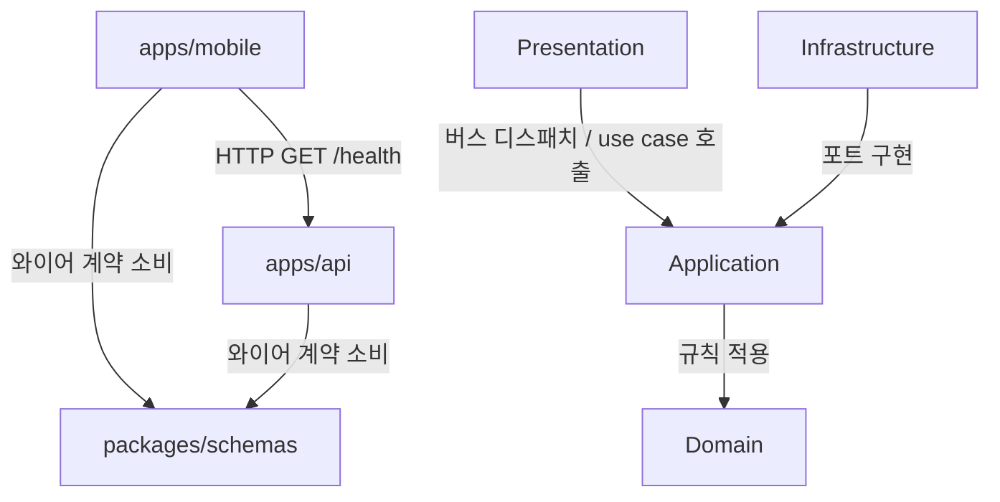

# social-media-fullstack Project Structure

> 생성일: 2026-09-16 · 문서 버전: 0.1 · Generator: architecture-generator

## 개요 (Overview)

Turborepo 2 + bun workspaces로 묶인 Workspace다. App은 둘 — `apps/mobile`(Expo SDK 57 + expo-router, domain-first ddd-hexagonal)과 `apps/api`(NestJS 12 ESM, ddd-hexagonal + CQRS) — 이고, 둘 다 Package `packages/schemas`(zod 와이어 계약 Schema, compiled ESM dist)를 소비한다. 설정 전용 Package `packages/typescript-config`(tsconfig base)와 `packages/biome-config`(Biome 공유 규칙 `base.json`)는 코드가 아니다. 루트에는 `package.json`(workspaces, packageManager bun@1.3.14), `bunfig.toml`(hoisted linker), `turbo.json`, `biome.json`, `docs/`가 있고, 각 중요 root(루트·`apps/mobile`·`apps/api`·`packages/schemas`)에 Agent doc(`AGENTS.md` 실체 + `CLAUDE.md` 한 줄 포인터)을 둔다.

도메인은 미정이라 두 App 모두 도메인 슬라이스가 0개다. API의 비도메인 `health` Vertical slice가 이후 바운디드 컨텍스트가 복제할 템플릿이며, 모바일은 `shared/`만으로 홈 화면에서 Health를 조회한다. 이 문서는 작성 시점 디스크에 코드가 없는 신규 생성물 기준 처방이다 — 트리와 레이어 경로는 첫 phase가 만든다. `packages/*`는 지원 프레임워크가 없어 서브패키지 절을 두지 않으며, `packages/schemas`는 관계 흐름도의 노드로만 나타난다.

## 저장소 구성 (Repository Layout)

- 형태: `monorepo`
- 모노레포 도구: `turbo`
- 서브패키지 수: 2

## 서브패키지 (Sub-packages)

### apps/mobile — expo (ddd-hexagonal)

#### Directory Tree

```tree
apps/mobile/
├── app.json                          # plugins expo-router · experiments.typedRoutes · web.output "single"
├── package.json                      # @social/mobile — scripts: start · typecheck(expo customize tsconfig.json && tsc --noEmit) · lint(biome) · test(jest --ci) · export:web
├── tsconfig.json                     # extends expo/tsconfig.base; paths @shared/* · @/assets/* (스캐폴드 @/* 제거); types ["jest"]
├── jest.setup.js                     # EXPO_PUBLIC_API_URL 기본값, flash-list jestSetup
├── .env.example                      # EXPO_PUBLIC_API_URL
├── AGENTS.md / CLAUDE.md             # Agent doc — 실체 + 한 줄 포인터
├── assets/
└── src/
    ├── app/                          # Routing shell — named re-export만, 자기 정의 0
    │   ├── _layout.tsx               # default ← @shared/presentation/layouts/root-layout
    │   ├── index.tsx                 # default ← @shared/presentation/screens/home-screen
    │   └── +not-found.tsx            # default ← @shared/presentation/screens/not-found-screen
    ├── {domain}/                     # 바운디드 컨텍스트마다 하나(단수 kebab-case) — 이번 phase에는 없음
    │   ├── domain/{entities,value-objects,events}/
    │   ├── application/{ports,use-cases/{verb-noun}}/
    │   ├── infrastructure/adapters/
    │   ├── presentation/{screens,layouts,view-models}/
    │   └── {domain}.module.ts        # 도메인 모듈 결선 — 유일하게 전 레이어를 아는 파일
    └── shared/
        ├── domain/                   # 자리 표시
        ├── infrastructure/
        │   ├── http/api-client.ts    # EXPO_PUBLIC_API_URL + /health 조회, @social/schemas로 파싱
        │   ├── query/query-client.ts # TanStack QueryClient
        │   └── storage/              # 공용 저장소 프리미티브 자리
        └── presentation/
            ├── components/health-check-row.tsx
            ├── layouts/root-layout.tsx           # Stack + QueryClientProvider + stylo ThemeProvider
            ├── screens/{home-screen,not-found-screen}.tsx (+ __tests__/)
            ├── errors/                           # 예외 → 화면 상태 매핑 자리
            └── theme/theme.ts                    # stylo-native defineThemes 1회, StyloTheme 증강
```

#### CA Layer 매핑 (Layer Map)

| Layer | 경로 | 역할 | 포함 항목 |
| --- | --- | --- | --- |
| Domain | `src/{domain}/domain/`, `src/shared/domain/` | 순수 비즈니스 규칙 — react-native/expo/서드파티 의존 0, 웹·네이티브 100% 공유. 이번 phase에는 도메인 슬라이스가 없어 `shared/domain/`은 자리 표시 | 엔티티, 값 객체, 도메인 이벤트(정의만), 도메인 예외, 엔티티 베이스 |
| Application | `src/{domain}/application/` | Use case 오케스트레이션과 포트 소유 — infrastructure/presentation/프레임워크 의존 0, 생성자 주입 클래스 | 포트 인터페이스(리포지토리·ACL), Use case(조회 포함) |
| Infrastructure | `src/{domain}/infrastructure/`, `src/shared/infrastructure/` | 포트 구현(어댑터) — 외부 시스템·네이티브·저장소 통합. `shared/`에는 API 클라이언트·Query 클라이언트·공용 저장소 프리미티브. 어댑터 모듈 최상위에서 네이티브 API에 접근하지 않는다 | Repository 구현, 네이티브/외부 API 어댑터, ACL 어댑터(유일한 크로스 컨텍스트 의존 지점), API 클라이언트(`http/`), TanStack QueryClient(`query/`), 공용 저장소 프리미티브(`storage/`) |
| Presentation | `src/{domain}/presentation/`, `src/shared/presentation/` | 프레임워크 접점 — 화면·레이아웃·뷰모델 실체. 화면은 use case만 소비하고 뷰모델로 매핑. Routing shell `src/app/`은 여기 실체를 named re-export만 한다 | 화면, 레이아웃(Stack·unstable_settings), 뷰모델, 공용 UI(`components/`), 루트 레이아웃(`layouts/`), 비도메인 화면(`screens/`), 예외 매핑 헬퍼(`errors/`), 테마(`theme/`) |

#### Path Aliases

| Alias | 해석 |
| --- | --- |
| `@{domain}/*` | `./src/{domain}/* — 도메인 디렉터리가 생길 때 추가` |
| `@shared/*` | `./src/shared/*` |
| `@/assets/*` | `./assets/* — 비도메인 자산 전용` |

#### Framework Conventions

##### Routing shell 규칙 (`src/app/`)

- **위치 고정**: `src/app/` — `app/`보다 우선하며 플러그인 `root` 옵션으로 바꾸지 않는다(공식 비권장).
- **내용 불변식**: named re-export만. 자기 정의(함수·클래스·상수) 0, 배럴식 전체 재노출 0. 예외 목록 없음 — 홈·404·루트 레이아웃도 `shared/presentation/` 실체를 가리킨다.
- **인식되는 re-export 심볼**: `default`, `unstable_settings`, `ErrorBoundary` — 모듈 네임스페이스에서 읽히므로 정의 위치가 도메인 presentation이어도 동작한다.
- **라우트 네이밍**: `_layout.tsx` · `index.tsx` · `[id].tsx` · `(group)/` · `+not-found.tsx`. `_`·`+`·`(group)` 외 파일은 전부 라우트다 — 테스트·컴포넌트를 두지 않는다.
- **루트 `_layout.tsx`는 Stack** — 탭은 `(tabs)/` 그룹 하위.
- `+api.ts` 라우트는 쓰지 않는다 — `web.output: "single"`.

##### 레이어별 프레임워크 접점 규칙

| Layer | `expo-router` / `react-native` / Expo SDK | 비고 |
|---|---|---|
| Domain | 금지 | 상대경로와 `@shared/domain/*`만 참조 — 웹/네이티브/Node 어디서든 평가 가능 |
| Application | 금지 | 포트·use case는 순수 TypeScript. infrastructure/presentation 경로 참조도 0 |
| Infrastructure | Expo SDK·저장소·네이티브 모듈 허용 | 모듈 최상위 접근은 금지 — 함수 안으로 지연하거나 Platform 가드 |
| Presentation | 전체 허용 | `expo-router`·`react-native`·stylo-native가 등장하는 유일한 층(`shared/presentation` 포함) |

##### 도메인 모듈 파일 (`{domain}.module.ts`)

- 유일하게 전 레이어를 아는 파일. 어댑터·use case를 직접 인스턴스화해 **하나씩** named export한다 — 포트 인스턴스는 포트 타입으로 선언해 구현 타입을 숨긴다. DI 컨테이너·Symbol 토큰 없음.
- 의존 방향: presentation(화면·레이아웃) → 모듈 파일 → 어댑터. DI가 없어 presentation이 모듈 파일을 참조하는 것은 허용되며 유일한 "바깥→안" 예외다. 레이어 표(`layers[].paths`)에는 넣지 않는다.
- 타 컨텍스트에 노출하는 것은 포트 타입 인스턴스뿐 — use case 인스턴스는 노출하지 않는다.
- 이번 phase에는 도메인 슬라이스가 없어 모듈 파일도 0개다.

##### 도메인 간 통신

- **동기 조회**: 소비 도메인이 자기 `application/ports/`에 좁은 ACL 포트를 선언하고, 자기 `infrastructure/adapters/`의 ACL 어댑터가 공급 도메인의 **포트 타입만** 타입 참조해 구현한다. 포트 인스턴스 결선은 소비 도메인 모듈 파일이 공급 도메인 모듈 파일에서 가져와 생성자에 명시적으로 넘긴다.
- **비동기/이벤트**: 발행 인프라 없음 — 도메인 이벤트 클래스는 `domain/events/`에 정의만 둔다.
- **네비게이션**: 컨텍스트 간 이동은 `href` 문자열(typed routes)로 일어난다. 라우트 경로 상수는 해당 컨텍스트의 presentation에 둔다.
- 타 도메인의 use case·화면·구현 클래스에는 어떤 경우에도 의존하지 않는다.

##### 경로 별칭 규칙

- 도메인 안에서는 상대경로, 컨텍스트 경계를 넘을 때만 별칭. `@{domain}/*`는 첫 도메인 디렉터리와 함께 `tsconfig.json` `paths`에 추가한다.
- 스캐폴드 기본 `@/*`(`./src/*`)는 **제거했다** — 비도메인 자산은 `@/assets/*`로만 접근. `~/*`·레이어별 별칭(`@app/*`, `@infra/*`)·도메인 루트 배럴(bare `@order`)은 만들지 않는다.
- 런타임 해석은 Metro `tsconfigPaths` 기본 활성 — `metro.config.js` 불필요. jest-expo가 `paths`를 `moduleNameMapper`로 자동 변환한다.
- 별칭 이름은 npm 스코프를 가린다 — 도메인 이름이 실제 스코프와 겹치면 도메인 이름을 바꾼다.

##### 내부 Package 소비 규칙

- `@social/schemas`는 **compiled ESM dist**를 소비한다 — 소스 경로나 tsconfig `paths`로 뚫지 않는다.
- `zod`를 mobile에서 직접 의존하지 않는다 — Metro가 zod를 두 벌 번들하는 이중 복사를 막기 위해 파싱은 `@social/schemas`가 노출하는 Schema로만 한다.
- turbo `^build` 의존: mobile의 `typecheck`·`test`·`export:web`은 `packages/schemas` build 후 실행된다.
- 소비 지점은 infrastructure 어댑터(`src/shared/infrastructure/http/`, 향후 `src/{domain}/infrastructure/adapters/`)로 제한 — 화면·use case가 Schema를 직접 파싱하지 않는다.

##### 툴체인 계약

- **typed routes**: `.expo/types/router.d.ts`·`expo-env.d.ts`는 `expo customize tsconfig.json`이 생성한다 — `typecheck` 스크립트는 customize → `tsc --noEmit` 순서(멱등). 생성물은 커밋하지 않는다.
- **`web.output: "single"`**: 정적 프리렌더 없음 — 라우트가 빌드 타임 Node에서 평가되지 않으며 `generateStaticParams`를 쓰지 않는다.
- **테스트 러너**: jest-expo + `@testing-library/react-native` 13.x(14.x는 `renderRouter` 쿼리 누락). `react-test-renderer`는 react 버전에 맞춘다. `jest.setup.js`가 `EXPO_PUBLIC_API_URL` 기본값과 flash-list setup을 등록한다.
- **테스트 위치**: 소스 옆 `__tests__/{basename}.test.tsx` — `src/app/` 아래 금지(라우트로 취급됨). 셸 파일은 테스트 대상이 아니며 라우팅 동작은 `renderRouter`로 실체 화면 테스트에서 검증한다.
- **경계는 툴체인이 잡지 않는다** — tsc·Metro·Biome 어느 것도 레이어/컨텍스트 경계 규칙이 없다. 컨벤션 문서의 grep 검증이 유일한 방어선이다.

##### 환경 변수

- 클라이언트에 노출되는 값은 `EXPO_PUBLIC_*` 접두만. 접근은 `process.env.EXPO_PUBLIC_API_URL`처럼 **점 표기 정적 접근만** — Metro가 빌드 타임에 인라인하므로 구조 분해·동적 키 접근은 값이 비어 버린다.
- `.env.example`만 커밋한다. `.env`·`.env.local`은 gitignore.

##### 스타일링 (stylo-native)

- 테마 정의는 `src/shared/presentation/theme/theme.ts` 한 곳 — `defineThemes` 호출 1회, `StyloTheme` 타입 증강도 같은 파일.
- 루트 레이아웃(`root-layout.tsx`)이 `ThemeProvider`에 store를 주입한다 — 도메인 레이아웃은 Provider를 다시 두지 않는다.
- 테마 sheet는 `useStyles` 경유로만 읽는다 — 컴포넌트가 theme 객체를 직접 참조하지 않는다.

##### 가정 / 미결 (신규 생성물 기준)

- 작성 시점 디스크에 코드가 없다 — 트리·레이어 경로는 템플릿 처방을 이 프로젝트 사양으로 구체화한 것이며 첫 phase가 만든다.
- 바운디드 컨텍스트 0개 — `{domain}` 자리는 이름 미정. 첫 도메인이 정해지면 `@{domain}/*` 별칭·`{domain}.module.ts`가 함께 생긴다.
- `src/shared/domain/`, `src/shared/infrastructure/storage/`, `src/shared/presentation/errors/`는 자리 표시 — 내용물은 미결.
- 템플릿의 `+api.ts` 라우트 행은 `web.output: "single"`이라 파일 위치 요약에서 제외했다.

#### File Location Summary

| 작업 | 위치 |
| --- | --- |
| 새 화면 | `src/{domain}/presentation/screens/{name}-screen.tsx + src/app/{route}/…tsx named re-export` |
| 네비게이터/레이아웃 | `src/{domain}/presentation/layouts/{name}-layout.tsx + src/app/{route}/_layout.tsx re-export` |
| 뷰모델 (응답 매핑) | `src/{domain}/presentation/view-models/` |
| Use case (조회 포함) | `src/{domain}/application/use-cases/{verb-noun}/` |
| 포트 정의 (리포지토리·ACL) | `src/{domain}/application/ports/` |
| 포트 구현 / ACL 어댑터 / 네이티브 어댑터 | `src/{domain}/infrastructure/adapters/` |
| 도메인 모듈 결선 | `src/{domain}/{domain}.module.ts` |
| 도메인 엔티티 / 값 객체 / 도메인 이벤트 | `src/{domain}/domain/{entities,value-objects,events}/` |
| 공용 베이스 / VO / 예외 | `src/shared/domain/` |
| 공유 와이어 계약(Schema) 소비 | `packages/schemas` |
| API 호출 클라이언트 | `src/shared/infrastructure/http/` |
| TanStack Query 클라이언트 | `src/shared/infrastructure/query/` |
| 공용 저장소 프리미티브 | `src/shared/infrastructure/storage/` |
| 공용 UI 컴포넌트 | `src/shared/presentation/components/` |
| 루트 레이아웃 | `src/shared/presentation/layouts/root-layout.tsx + src/app/_layout.tsx` |
| 비도메인 화면 (홈·404) | `src/shared/presentation/screens/ + src/app/index.tsx·+not-found.tsx` |
| 도메인 예외 → 화면 상태 매핑 | `src/shared/presentation/errors/` |
| 테마 정의 | `src/shared/presentation/theme/theme.ts` |
| 단위 테스트 | `소스 옆 __tests__/ (라우트 루트 밖)` |
| 플랫폼 분기 | `src/{domain}/presentation/**/{name}.web.tsx 등 — 셸은 접미사 없는 경로` |
| 정적 자산 | `assets/ (@/assets/*)` |

### apps/api — nestjs (ddd-hexagonal)

#### Directory Tree

```tree
apps/api/
├── package.json                      # @social/api — "type": "module"; imports #shared/* · #health/* → ./dist/…; scripts build(nest build) · dev · test(vitest) · test:e2e · typecheck · lint(biome) · db:ensure
├── nest-cli.json
├── tsconfig.json                     # extends @social/typescript-config/base.json; module/moduleResolution nodenext; emitDecoratorMetadata; types ["vitest/globals","node"]; paths #shared/* · #health/* → ./src/…
├── tsconfig.build.json
├── vitest.config.ts                  # 단위 — vite-tsconfig-paths
├── vitest.config.e2e.ts              # e2e — vite-tsconfig-paths
├── drizzle.config.ts                 # dialect postgresql; schema → src/shared/infrastructure/database/drizzle/schema/index.ts; out ./drizzle
├── .env.example                      # DATABASE_URL, PORT
├── AGENTS.md / CLAUDE.md             # Agent doc — 실체 + 한 줄 포인터
├── scripts/
│   └── ensure-db.sh                  # docker exec postgres psql — DB social_media 멱등 생성
├── src/
│   ├── health/                       # 비도메인 템플릿 Vertical slice — 이후 {domain}/이 같은 모양
│   │   ├── application/
│   │   │   ├── ports/database-ping.port.ts
│   │   │   └── queries/
│   │   │       ├── get-health.query.ts
│   │   │       └── handlers/get-health.handler.ts (+ index.ts 배열 상수)
│   │   ├── infrastructure/adapters/drizzle-database-ping.adapter.ts
│   │   ├── presentation/
│   │   │   ├── dtos/health-response.dto.ts
│   │   │   └── health.controller.ts
│   │   └── health.module.ts
│   ├── {domain}/                     # 바운디드 컨텍스트(단수 kebab-case) — 이번 phase에는 없음
│   │   ├── application/{ports,use-cases/{verb-noun},queries/handlers,events,sagas}/
│   │   ├── domain/{entities,value-objects,events}/
│   │   ├── infrastructure/adapters/
│   │   ├── presentation/{dtos/,{domain}.controller.ts}
│   │   └── {domain}.module.ts        # 컴포지션 루트 — 유일하게 전 레이어를 아는 파일
│   ├── shared/
│   │   ├── domain/                   # 자리 표시 — 애그리게잇 베이스·공용 VO·예외 위계
│   │   └── infrastructure/
│   │       ├── config/env.schema.ts  # zod env 검증(DATABASE_URL, PORT)
│   │       ├── database/drizzle/
│   │       │   ├── drizzle.module.ts # 전역 DB 모듈 — 풀 생성, destroy 훅에서 종료
│   │       │   └── schema/index.ts   # 영속성 스키마 자리 — {domain-복수형}.schema.ts 집결
│   │       └── filters/              # 전역 예외 필터 자리
│   ├── app.module.ts                 # 전역 1회 등록(ConfigModule·CqrsModule·DrizzleModule) + 슬라이스 조립
│   └── main.ts                       # bootstrap: ValidationPipe, shutdown hooks, listen
├── test/
│   └── health.e2e-spec.ts            # 실 DB e2e
└── dist/                             # nest build 출력 — package.json imports가 가리키는 런타임 경로
```

#### CA Layer 매핑 (Layer Map)

| Layer | 경로 | 역할 | 포함 항목 |
| --- | --- | --- | --- |
| Domain | `src/{domain}/domain/`, `src/shared/domain/` | 순수 비즈니스 규칙 — 프레임워크 접점은 shared의 애그리게잇 베이스 하나로 수렴. 이번 phase에는 도메인 슬라이스가 없고 `health`는 비도메인이라 `domain/`을 갖지 않는다 | 애그리게잇, 엔티티, 값 객체, 도메인 이벤트, 도메인 예외 |
| Application | `src/{domain}/application/` | Use case 오케스트레이션과 포트 소유. 핸들러·saga 파일만 DI/CQRS 데코레이터 허용. `health/application/`(ports + queries)도 같은 규칙 | Command, Query, 핸들러, 포트(토큰+인터페이스), 이벤트 핸들러, Saga |
| Infrastructure | `src/{domain}/infrastructure/`, `src/shared/infrastructure/` | 포트 구현(어댑터) — 외부 시스템 통합(NestJS 전체 기능 허용). `shared/`에는 env 검증·전역 DB 모듈·영속성 스키마·전역 필터. `health/infrastructure/`의 DB ping 어댑터도 같은 규칙 | Repository 구현, 외부 API/게이트웨이 어댑터, env 검증 스키마(`config/`), Drizzle 모듈·영속성 스키마(`database/drizzle/`), 전역 필터(`filters/`) |
| Presentation | `src/{domain}/presentation/` | 얇은 HTTP 표면 — 버스 디스패치 중심(웹훅 등 raw body 작업만 포트 직접 소비). `health.controller.ts`도 같은 규칙 | Controller, 요청/응답 DTO(Schema 추론 타입을 구현하는 class-validator 클래스) |

#### Path Aliases

| Alias | 해석 |
| --- | --- |
| `#{domain}/*` | `./src/{domain}/* (tsconfig paths) · ./dist/{domain}/* (package.json imports, 런타임) — 도메인 생길 때 양쪽에 추가` |
| `#shared/*` | `./src/shared/* (tsconfig paths) · ./dist/shared/* (package.json imports, 런타임)` |

#### Framework Conventions

##### 레이어별 데코레이터 사용 규칙

| Layer | `@nestjs/*` | 비고 |
|---|---|---|
| Domain | 금지 | 유일 예외: `shared/domain/aggregate-root.ts`가 `@nestjs/cqrs`의 AggregateRoot를 감싸는 단일 유출점 |
| Application | 핸들러 파일은 `@QueryHandler` / `@CommandHandler` / `@EventsHandler` + `@Inject`, saga 파일은 `@Saga` + `@Injectable` | command·query·event 메시지 클래스와 포트 파일은 데코레이터 0 |
| Infrastructure | 전체 허용 | `@Injectable`, drizzle, 외부 SDK 자유 |
| Presentation | 전체 허용 | `@Controller`, `@Get`, `@Body`, class-validator 데코레이터 |

##### 모듈 등록 (`{domain}.module.ts` · `app.module.ts`)

- 포트 바인딩: `provide`에 Symbol 토큰, `useClass`에 어댑터. 다중 구현을 런타임에 고르면 `useFactory`.
- 핸들러는 배럴 `index.ts`의 **배열 상수**(`QueryHandlers` · `CommandHandlers` · `EventHandlers`)를 providers에 스프레드 — 배럴은 재노출이 아니다.
- `exports`에는 타 도메인이 쓸 **포트 토큰만** 올린다 — 구현 클래스를 노출하지 않는다.
- 전역 1회 등록(`ConfigModule.forRoot({isGlobal})` · `CqrsModule.forRoot()` · `DrizzleModule`)은 `app.module.ts` 전용 — 슬라이스 모듈에서 재등록하지 않는다.
- `health.module.ts`가 이 규칙의 첫 실체다 — 이후 `{domain}.module.ts`는 같은 모양을 복제한다.

##### 도메인 간 통신

- **동기 조회**: 소비 도메인이 자기 `application/ports/`에 좁은 ACL 포트를 선언하고, 자기 `infrastructure/adapters/`의 어댑터가 공급 도메인 모듈이 export한 토큰을 주입받아 구현한다. 소비 도메인 모듈은 공급 도메인 모듈을 `imports`에 추가한다.
- **비동기**: 전역 이벤트버스 경유 — 발행 도메인의 `domain/events/` 클래스를 구독측 saga·이벤트 핸들러가 직접 참조한다(클래스 identity 매칭). 구독만 하는 관계는 모듈 import가 필요 없다.
- 타 도메인의 use case·컨트롤러·구현 클래스에는 어떤 경우에도 의존하지 않는다.

##### `main.ts`의 역할

- Bootstrap만 담당: 전역 ValidationPipe(`whitelist`), shutdown hooks 활성화, `listen`.
- 비즈니스 로직 없음 — TDD 예외. 전역 예외 필터는 `shared/infrastructure/filters/`가 채워지면 여기서 등록한다.

##### ESM 규칙

- `package.json`의 `"type": "module"` + tsconfig `module`/`moduleResolution` `nodenext`.
- 상대 경로 참조는 소스가 `.ts`여도 **`.js` 확장자를 명시**한다 — Node ESM 해석기가 확장자를 추론하지 않는다.
- 타입만 쓰는 참조(포트 인터페이스, DTO 타입)는 `import type`으로 가져온다. 주입은 `@Inject(토큰)`으로 명시하며 `emitDecoratorMetadata`의 타입 메타데이터에 기대지 않는다.

##### 별칭 런타임 해석

- `#shared/*`·`#{domain}/*`는 Node **서브패스 imports**(`#` 접두)다. `@` 접두 대신 `#`인 이유: tsconfig `paths`는 타입체커용이라 런타임 해석을 보장하지 않는데, `package.json` `imports` 필드는 Node·bun 런타임이 표준으로 해석하고 `#`은 npm 스코프(`@`)와 충돌하지 않는다.
- 두 곳을 항상 함께 유지한다: tsconfig `paths` → `./src/…`(tsc·vitest는 vite-tsconfig-paths), `package.json` `imports` → `./dist/…`(런타임, `nest build` 출력).
- AC는 dist에서 실행한 프로세스가 별칭 경로를 실제로 해석하는지로 검증한다 — 타입체크 통과만으로는 부족하다.

##### 내부 Package 소비

- `@social/schemas`는 **compiled ESM dist**를 소비한다 — workspace 링크, turbo `^build` 의존.
- DTO(`presentation/dtos/`)는 Schema 추론 타입을 구현한다 — 와이어 형태의 단일 진실은 Schema, DTO는 class-validator 표면이다.
- 영속성 스키마(drizzle)와 Schema(zod)는 별개다 — 서로 참조하지 않는다.

##### 테스트

- 단위: vitest `*.spec.ts` 소스 옆(`types: ["vitest/globals"]`).
- e2e: `test/*.e2e-spec.ts` — `vitest.config.e2e.ts`, 실 DB(`DATABASE_URL`).
- DB 풀은 `DrizzleModule`의 destroy 훅에서 종료한다 — e2e가 hang 하지 않도록.
- `main.ts`는 테스트 대상이 아니다.

##### 환경

- `.env.example`(`DATABASE_URL`, `PORT`)만 커밋한다. env는 `config/env.schema.ts`가 부팅 시 검증한다.
- `db:ensure`(`scripts/ensure-db.sh`) — docker postgres 컨테이너에 `social_media` DB를 멱등 생성. dev·e2e 전에 실행한다.

##### 가정 / 미결 (신규 생성물 기준)

- 작성 시점 디스크에 코드가 없다 — 트리·레이어 경로는 템플릿 처방을 이 프로젝트 사양으로 구체화한 것이며 첫 phase가 만든다.
- 바운디드 컨텍스트 0개 — `#{domain}/*` 별칭은 첫 도메인 생성 시 tsconfig `paths`·`package.json` `imports` 양쪽에 추가한다.
- `health`는 비도메인이라 `domain/`을 두지 않는다 — 이후 도메인 슬라이스는 `domain/`을 포함한 4레이어 전체다.
- `src/shared/domain/`, `filters/`, `database/drizzle/schema/index.ts`는 자리 표시 — 내용물은 미결.

#### File Location Summary

| 작업 | 위치 |
| --- | --- |
| REST endpoint 추가 | `src/{domain}/presentation/{domain}.controller.ts` |
| 요청/응답 DTO | `src/{domain}/presentation/dtos/` |
| Use case (command+handler) | `src/{domain}/application/use-cases/{verb-noun}/` |
| 조회 (query+handler) | `src/{domain}/application/queries/ + queries/handlers/` |
| 포트 정의 | `src/{domain}/application/ports/` |
| 포트 구현 (adapter/repository) | `src/{domain}/infrastructure/adapters/` |
| 도메인 엔티티/애그리게잇 | `src/{domain}/domain/entities/` |
| 값 객체 | `src/{domain}/domain/value-objects/` |
| 도메인 이벤트 | `src/{domain}/domain/events/` |
| 이벤트 구독 핸들러 | `src/{domain}/application/events/` |
| Saga | `src/{domain}/application/sagas/` |
| 모듈 등록 (컴포지션 루트) | `src/{domain}/{domain}.module.ts` |
| 공용 베이스/VO/예외 | `src/shared/domain/` |
| 공유 와이어 계약(Schema) 소비 | `packages/schemas` |
| env 검증 스키마 | `src/shared/infrastructure/config/` |
| 영속성 스키마 (drizzle) | `src/shared/infrastructure/database/drizzle/schema/{domain-복수형}.schema.ts` |
| DB 모듈 · 전역 필터 | `src/shared/infrastructure/` |
| DB 준비 스크립트 | `scripts/ensure-db.sh` |
| E2E 테스트 | `test/` |
| 단위 테스트 | `소스 옆 *.spec.ts` |

## 관계 흐름도 (Relationship Diagram)


